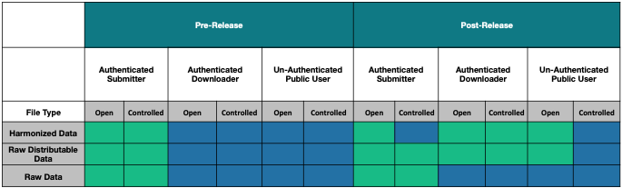

# Data Access Matrix

Data submitters and downloaders have access to different files in the GDC system at different times.  Below is a matrix that describes when particular types of files are available to download for specific types of users.  

## Types of Files
###Harmonized Data Files
These are files produced by the GDC as part of our harmonization workflows.  Technically, this refers to any file node in the GDC Data Dictionary that has the flags `Submittable` = `FALSE` and `Downloadable` = `TRUE`.

###Raw Data Files
These are files contributed by data submitters that are the input for our harmonization workflows.  These files are not made available in the GDC Data Portal.  Technically, this refers to any file node in the GDC Data Dictionary that has the flags `Submittable` = `TRUE` and `Downloadable` = `FALSE`.

###Raw Distributable Files
These are files that are contributed by data submitters but are then directly shared with the community on the GDC  Data Portal.  This includes files like clinical and biospecimen supplements and slide images files.  Technically, this refers to any file node in the GDC Data Dictionary that has the flags `Submittable` = `TRUE` and `Downloadable` = `TRUE`.

## Types of Users
###Authenticated Submitter
These are users that have submission access to a particular project in dbGaP.  Users with this access will have a check under `download` within their User Profile in the GDC.

###Authenticated Downloader
These are users that have downloader access to a particular project in dbGaP.  Users with this access will have a check under `_member_` within their User Profile in the GDC.

###Unauthenticated Public User
These are users that have not logged into the GDC.  
